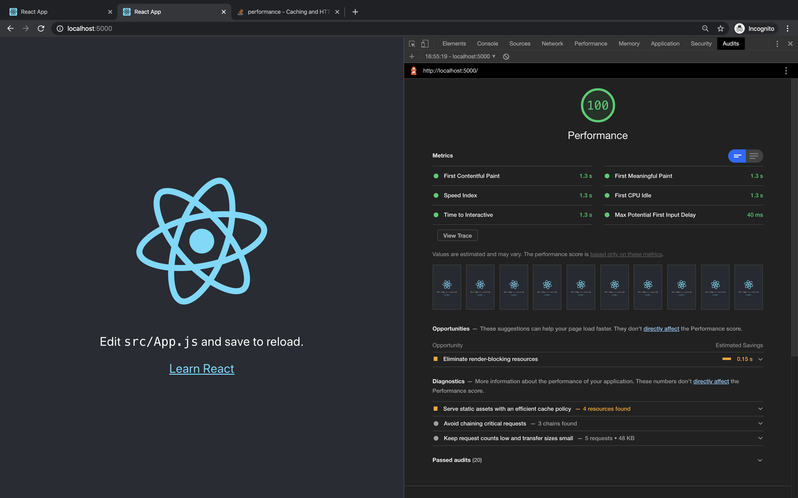
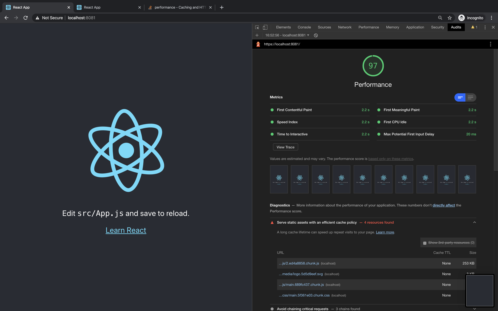
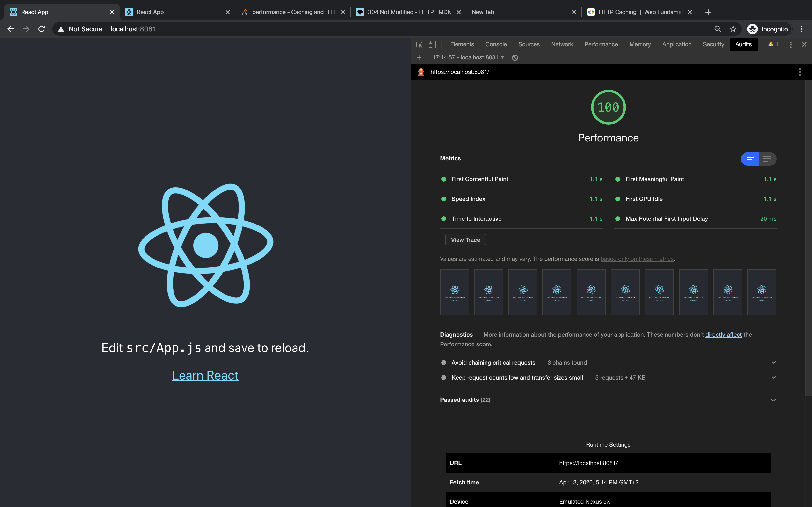
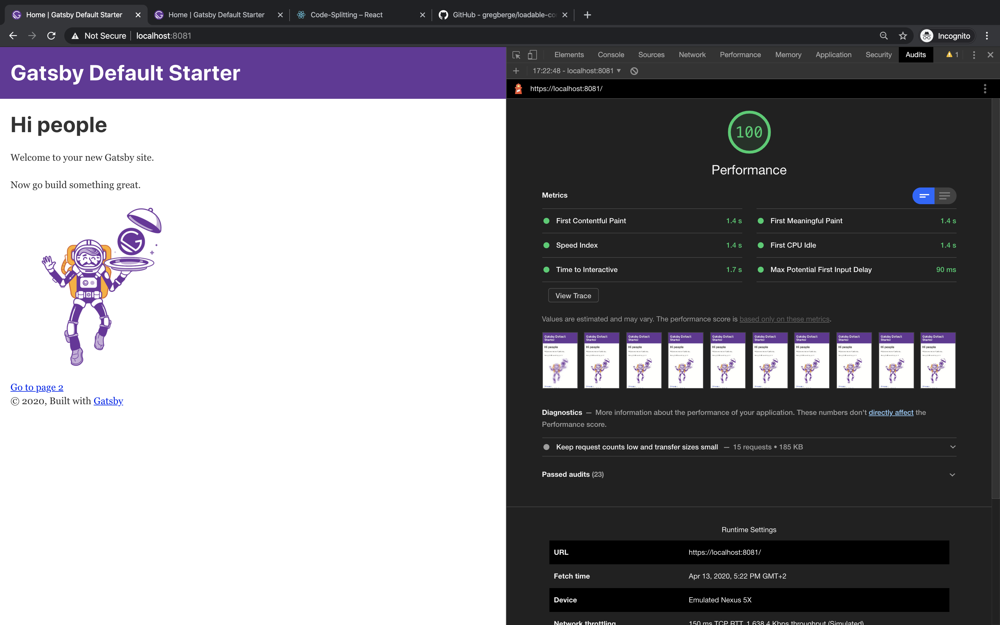

### How to Run

```
yarn install
```

```
node server/<name>.js
```

ex: node server/spdyFileServer.js


### Create native http2 server with local cert

- native support in node with http2 module
- can check in the browser for protocol that h2 protocol is used.


## Create React App Benchmark

CRA HTTP/1 (baseline)


CRA HTTP/2 (first try)


CRA HTTP/1 (with caching)


## Gatsby Benchmark

Gatsby HTTP/1 (baseline)


Gatsby HTTP/2



Links:

https://gist.github.com/inian/644aa5cc2dee82782e114a67dde92fb0
https://webapplog.com/http2-node/
https://nodejs.org/api/http2.html
https://github.com/google/node-h2-auto-push
https://github.com/google/node-fastify-auto-push
https://www.npmjs.com/package/spdy
https://itnext.io/using-http-2-with-next-js-express-917791ca249b
https://medium.com/the-node-js-collection/say-hello-to-http-2-for-node-js-core-261ba493846e
https://medium.com/the-node-js-collection/node-js-can-http-2-push-b491894e1bb1
https://letsencrypt.org/docs/certificates-for-localhost/
